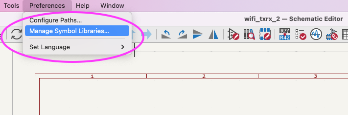
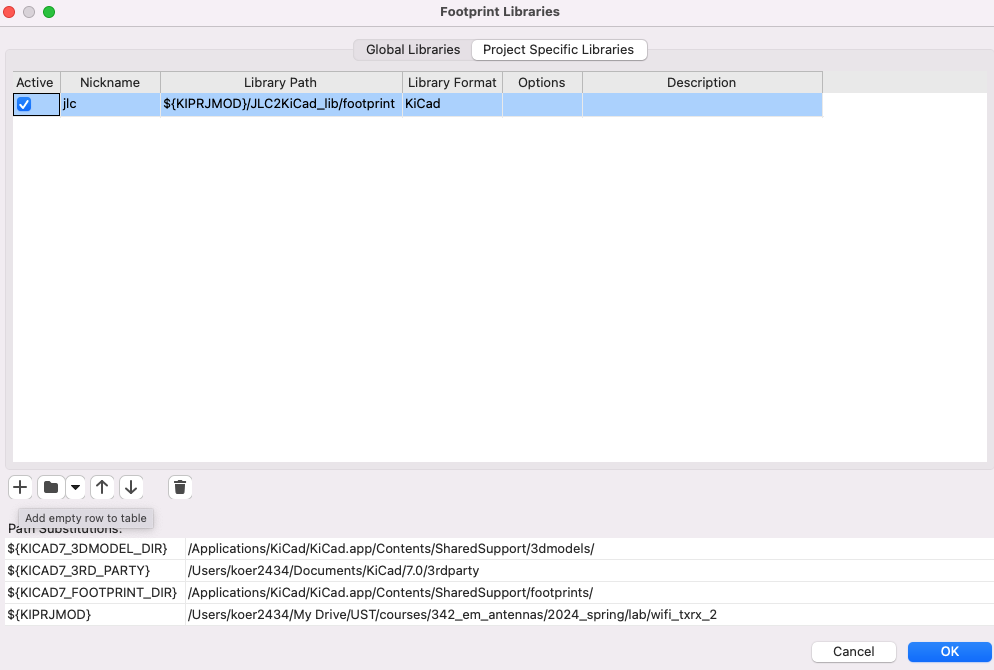

## Symbols (schematic editor)

In the schematic editor 'Manage Symbol Libraries' to add the library you cloned to the 'Project Specific Libraries'. Click the '+' button in the lower-left and add the nickname 'jlc'.

## Footprints (layout editor)

Do the same steps in the layout editor. Remember to use the nickname 'jlc'.

## Test library setup

In the schematic add a symbol and search for 'jlc'. You should see 8 available parts.

